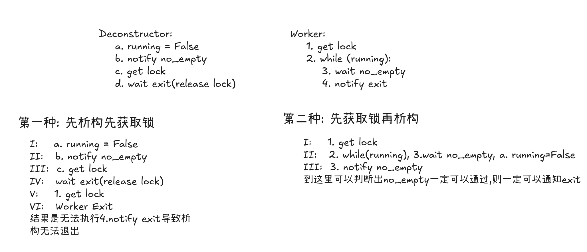

## 流程分析
+ 每个task都有一个result
+ 每个result也有一个task
+ 当submit一个task的时候,返回一个result
+ 这个result与一个task互相绑定
+ threadFunc执行这个task的时候会将run方法返回的结果作为result的值

## 死锁分析

# 动态库
编译的时候从/usr/local/lib 或者 /usr/lib下寻找so库
但是运行的时候在ld.so.cache中寻找